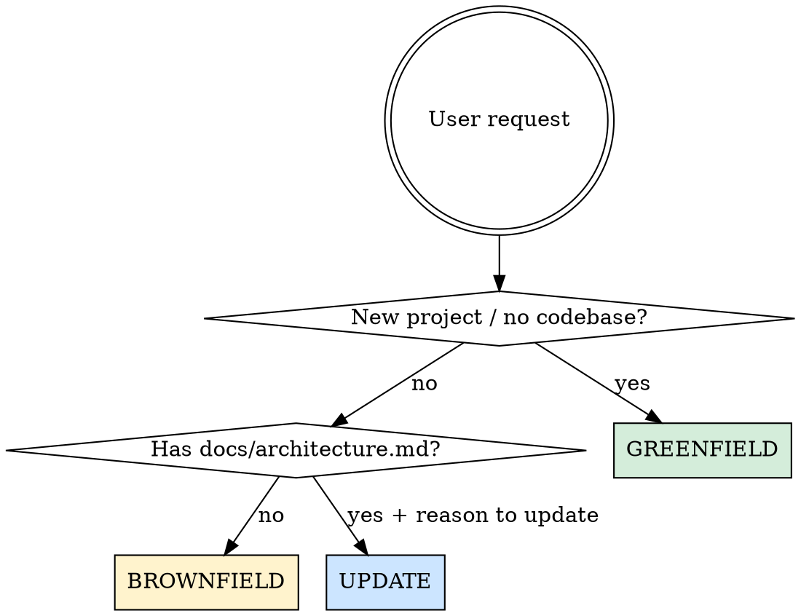

# PlanFirst

Calm down. You don't need Kafka yet. Design the right architecture before writing code.

## Core Principle

**Recommend what fits the project NOW, not what's trendy.** A solo MVP doesn't need Redis. A social network with 200k users shouldn't use Supabase just for the DB. Every recommendation must link to a specific project dimension.

## Flow Selection



---

## GREENFIELD Flow (new project)

**Trigger:** User describes a new project, asks what stack/infra to use, or says "start architecture".

**Input needed:** project description (natural language) + project root path.

### Step 1: Extract Dimensions

Read `extraction-rules.md` in this skill directory. Analyze the user's description and score each dimension:

| Dimension | Type | Values |
|-----------|------|--------|
| project_moment | enum | validate, grow, scale, optimize, unknown |
| product_type | enum | web, mobile, cli, game, iot, data_pipeline, desktop, other, unknown |
| team_size | number/null | inferred from description |
| user_scale | enum | lt_1k, lt_10k, lt_100k, lt_1m, gt_1m, unknown |
| monthly_budget | string/null | if mentioned |
| needs_realtime | bool/null | inferred from features |
| access_pattern | enum | read_heavy, write_heavy, balanced, graph_like, time_series, unknown |
| has_offline_requirement | bool/null | inferred |
| latency_critical | bool/null | inferred |

For each dimension, assign:
- `value` — inferred value
- `confidence` — 0.0 to 1.0 (use rules from extraction-rules.md)
- `signal` — the text fragment that led to inference

### Step 2: Follow-Up Questions (if needed)

If ANY dimension has confidence < 0.7:
- Pick the dimensions below 0.7
- Ask **max 4 questions** per round
- Questions must be **conversational**, not form-like

**BAD:** "What is your expected user scale?"
**GOOD:** "Do you have a rough idea of how many users you're expecting in the first few months?"

**BAD:** "Is real-time required?"
**GOOD:** "Will users need to see updates from each other live, like in a chat or activity feed?"

Include a brief "why it matters" for each question. Wait for answers, then re-score. Repeat until all dimensions >= 0.7.

### Step 3: Generate Recommendation

Read `recommendation-rules.md` in this skill directory. Based on extracted dimensions, produce:

1. **Stack — Use Now**: each item with name, role, why_now, when_to_replace
2. **Stack — Add Later**: each with measurable trigger (not "when you need it")
3. **Stack — Avoid** (MANDATORY, min 2 items): each with reason + when to reconsider
4. **Decisions**: ADRs with choice, why, tradeoff, revisit_when
5. **Cost estimate**: monthly_now, monthly_at_next_stage, cost_traps
6. **Diagrams**: ASCII + Mermaid
7. **Agent rules**: direct instructions for the coding agent

### Step 4: Write Output

Write two files using the templates in the "Output Format" section below.

---

## BROWNFIELD Flow (existing project)

**Trigger:** User asks to review/diagnose an existing project's architecture, or says "review architecture".

**Input needed:** project root path + optional description.

### Step 1: Scan Project

Use Glob, Read, and Bash to gather:

1. **Directory tree** (max depth 4). Ignore: `node_modules`, `.git`, `dist`, `build`, `.next`, `__pycache__`, `.venv`, `venv`, `coverage`

2. **Manifests** in project root: `package.json`, `requirements.txt`, `pyproject.toml`, `Gemfile`, `go.mod`, `pom.xml`, `build.gradle`. Read first 2000 chars of each.

3. **Schema files** — search recursively in `models/`, `schemas/`, `db/`, `database/`, `migrations/`, `src/`, `app/`, `lib/`, `core/` for extensions `.prisma`, `.sql`, `.graphql`, `.gql` and filenames `schema.prisma`, `schema.rb`, `models.py`, `schema.sql`. Cap: 2000 chars per file, max 10 files.

### Step 2: Diagnose

Read `brownfield-rules.md` in this skill directory. Analyze scan results and produce:

1. **Detected stack** — what's being used
2. **Current moment** — with confidence score
3. **Access patterns** — inferred from schema and code
4. **Diagnosis**: what's working well, technical debt (with impact), premature complexity
5. **Evolution roadmap**: next move + phased roadmap with measurable triggers
6. **Stack recommendations**: keep, replace (with migration notes), add later

### Step 3: Write Output

Same output format as greenfield (adapted for brownfield content).

---

## UPDATE Flow

**Trigger:** User wants to update an existing architecture doc, or says "update architecture".

**Input needed:** project root path + reason for update.

### Step 1: Read Existing

Read `docs/architecture.md` in the project. If it doesn't exist, tell the user to run greenfield or brownfield first.

### Step 2: Update

- **Preserve** what's working
- **Address** the specific reason for update
- **Add new ADRs** for changes (don't modify existing ones)
- **Update** diagrams, agent rules, and cost estimates

### Step 3: Write Output

Overwrite `docs/architecture.md` and update the agent file block.

---

## Output Format

### File 1: `docs/architecture.md`

```markdown
# {Project Name} — Architecture

> Generated on {YYYY-MM-DD} | Momento: **{moment}** — {moment_description}

## Summary
{2-3 sentence executive summary}

## Architecture Diagram (ASCII)
```
{ascii diagram}
```

## Architecture Diagram (Mermaid)
```mermaid
{mermaid diagram}
```

## Use Agora
### {Technology Name}
- **Role:** {what it does}
- **Why now:** {why this fits the current moment}
- **When to replace:** {measurable trigger}

## Adicionar Depois
- **{Name}** — add when: {measurable trigger}. Not now because: {reason}

## Nao Usar Agora
- **{Name}** — {reason}. Reconsider when: {trigger}

## Architecture Decision Records
### ADR-001: {Decision}
- **Choice:** {what was chosen}
- **Why:** {rationale}
- **Tradeoff:** {what you give up}
- **Revisit when:** {trigger}

## Cost Estimate
- **Monthly now:** {estimate}
- **Monthly at next stage:** {estimate}
### Cost Traps
- {trap description}

## Agent Rules
- {RULE — direct instruction, not suggestion}

---
Para atualizar, rode `/planfirst` novamente.
```

### File 2: Agent File Injection

Detect which agent file exists in project root (in priority order):
1. `CLAUDE.md` — Claude Code
2. `.cursorrules` — Cursor
3. `.windsurfrules` — Windsurf
4. `AGENTS.md` — Codex / others

If none exists, create `CLAUDE.md`.

Inject this block (replace if markers already exist):

```markdown
<!-- planfirst:start -->
## Architecture Reference
Full spec: `./docs/architecture.md` — read before adding any infrastructure.

### Stack (momento: {moment})
- {role}: {technology}

### Agent Rules
- {RULE}
<!-- planfirst:end -->
```

---

## Critical Rules

- **Max 4 questions per round** — never dump all dimensions as a form
- **Questions must sound like conversation**, not interrogation
- **Every recommendation must link to a project dimension** — no "because it's popular"
- **"Nao Usar Agora" section is MANDATORY** — minimum 2 items
- **Triggers must be measurable** — "when daily active users exceed 10k", not "when you need it"
- **Agent rules are instructions, not suggestions** — "DO NOT add Redis" not "consider avoiding Redis"
